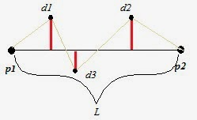
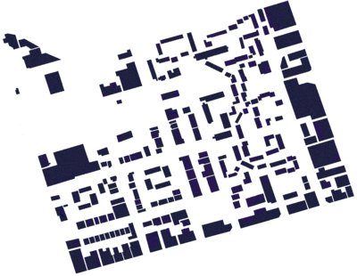
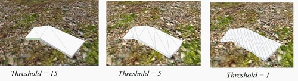

Generating Buildings From Footprints
====================================

This is a collection of scrips i have written for extracting buildings from building footprints, for a project in the Computer Graphics course at KTH 2014.

It is written in C# for Unity 3D.

# How it works

It uses [Moores-Neighbor Tracing](http://www.imageprocessingplace.com/downloads_V3/root_downloads/tutorials/contour_tracing_Abeer_George_Ghuneim/moore.html)
to get all the boundary points of the footprint, then constructs a plane from them, and drags it out into the 3rd dimmension.

But it is not good to simply cunstruct a plane directly from these points, so I use another method to eliminate the *non-importan* points.

Eliminating Boundary Points
---------------------------

Using Moores-Neighbor tracing algorithm we have an ordered list of boundary points.
Now we want to pick out the most *important* points, from which we will construct a plane.
This is the hard part and might be hard to follow.

Let *Pn* and *Pm* be two boundary points *n < m*, meaning *Pn* comes before *Pm* in the ordered list of boundary points.

Let *L = Line(Pn,Pm)* be a line between the points *Pn* and *Pm*, and *distance(Pi, L)* be the distance between the line *L* and some random boundary point *Pi*.

Now we can define the function *errorsum(Pn, Pm)* as
*errorsum(Pn,Pm) = distance(Pn+1, L)+distance(Pn+2,L)+...+distance(Pm-2,L)+distance(Pm-1,L)*

In this image *p1* and *p2* are *Pn* and *Pm*, *d1* to *d3* are *Pn+1* to *Pm-1*, *L* is *Line(Pn,Pm)* and the red lines are *distance(Pi, L)*

Now to pick out the most important points pick a value for the threshold, e.g. 7, and do the following

1. Pick the first point and call it *P1*.
2. Define the next *good* point, *P1* as the last point in the list for which it holds that *errorsum(P1,P2) <= threshold*
3. Add *P1* to the list of *good points*
4. Rename *P2* to *P1*.
5. Repeat from *2.* until you hit the end of boundary points.

Now we have a list of *good points* from which we can construct a plane, add some walls and a roof and ** * poof * ** it's a building.

# Result

This is an example of a building footprint map:

This was the result

And this is the effect of different values for the threshold

# Problems

Before using these scripts you should be aware of a few problems

* This method will not generate buildings with holes.
* The footprint map should preferably be black and white.
* Because of the way I piece together the planes some buildings, like L-shaped once, will look weird if the threshold value is to high.
* The buildings don't actually look so good :P
